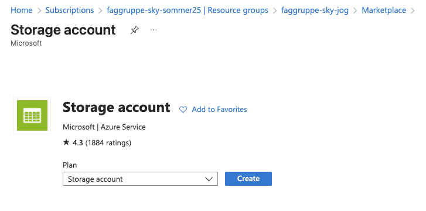

# Initielt oppsett

Det er vanlig å lagre tfstate remote, slik at alle har tilgang til samme tfstate og får med seg endringer som gjør slik at man ikke sletter ting som skal være oppe.

Den lagres enkelt og greit i det som heter en blob container i en storage account. Dette kan opprettes på flere måter. Den første er å "click-oppse" (click operation). En annen måte er å definere det gjennom terminalen. Vi gjør dette kjapt fordi det er enklest

Du kan begynne med å sjekke at du er logget inn og bruker riktig subcription:

```
az login
```

Du kan så finne subscription_id og tenant_id og legge de inn i ```terraform.tfvars```.
```
az account list --output table
```

Etter det kjører vi på med å bootstrappe. Dette er en ting man gjør en gang for å sette opp nødvendig backend for at terraform skal kunne kjøre av seg selv. Bytt til ```terraform/bootstrap```. 

```terraform.tfvars``` med subscription_id og tenant_id må altså ligge i både ```/bootstrap``` og ```/infra```.


FØR du init-er må du oppdatere verdiene som ligger i variables.tf til din egen ressursgruppe! Det gjør at du får mye lettere oversikt over dine egne ressurser.

```
terraform init
terraform apply -var-file="terraform.tfvars"
```
Etter du har gjort det har du satt opp ting så det er klart for senere bruk! Bytt til den mappen vi skal jobbe med fra nå! 

```
cd ../infra
```

Dersom alt funker kan du hoppe videre på del 2! :)

<br/>
<br/>
<br/>
<br/>
<details>
  <summary>Bugfixing notater og manuelt oppsett, du trenger ikke se på denne</summary>
  
Begynn med å sjekke at du er logget inn og bruker riktig subscription:

```
az login
```

Så kan du finne navnet på ressursgruppen din:
```
az group show --name <dittnavn-resource-group>
```


```
az storage account create \
  --name jogstorageacct \
  --resource-group faggruppe-sky-jog \
  --location northeurope \
  --sku Standard_LRS \
  --kind StorageV2 \
  --subscription 456a104d-742c-45e5-bd46-22c5939d4396
```

Få tak i nøkkelen til storage account som vi skal bruke til å opprette 
```
az storage container create \
  --name tfstate \
  --account-name jogstorageacct \
  --account-key <storage-account-key>


```
```
az storage container create \
  --name tfstate \
  --account-name jogstorageacct \
  --account-key <storage-account-key> \
  --public-access off
```


Etter du har gjort det skal du nå ha en plass å lagre din tfstate i skyen!

Vi skal nå gjøre det som kalles bootstrapping, en ting man gjør første gangen man oppretter et prosjekt i skyen!


Bugfixing:
az account tenant list 

List sub og tenant:
az account list --output table


Vi kan så definere



NB! Hvis du har vært borti andre Azure prosjekter må du huske å velge den for faggruppe-sommer-25!

Sett redundancy til Locally-redundant storage (LRS)

klikk next, set access tier til cool

Gå til ressursen, i menyen til høyre skal du finne Data Storage, det er her du setter opp de objektene som skal lagre dataen du har. Trykk her på containers. Lag en ny container og kall den ```tfstate```.

</details>
